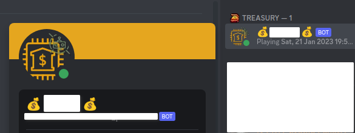
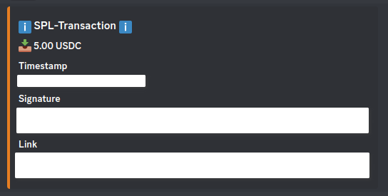
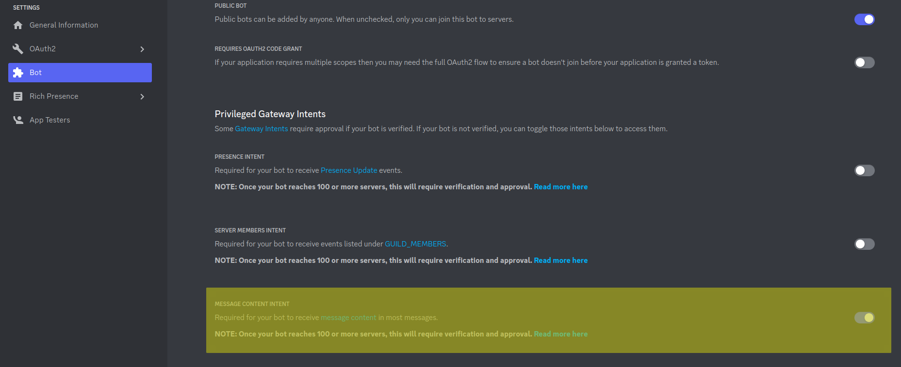
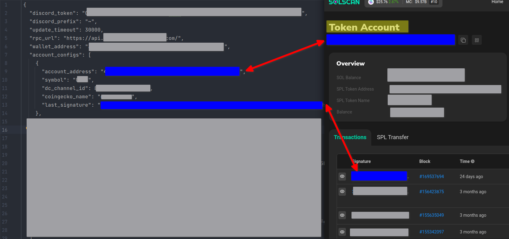

[](https://github.com/ellerbrock/open-source-badges/)
[](https://github.com/DerZwergGimli/RustSolanaDiscordWalletTracker/actions/workflows/build-test.yml)
[](https://github.com/DerZwergGimli/RustSolanaDiscordWalletTracker/actions/workflows/deploy-docker.yml)
[](https://opensource.org/licenses/MIT)


# Rust Solana Discord Tracker

A simple discord-bot for monitoring a Solana-Wallet with some specified token-accounts and post all transactions into a
channel.

## Features

- Configure: Token accounts to watch
- Configure: UpdateTime and RPC-Endpoint
- Configure: bot prefix
- Request wallet token account balances
- Post transaction info form token-accounts into a channel
- Fetch prices form coingecko

## View

Bot-Appearance (icon can be changed via Discord-developer portal):



Bot-Sample Message:



## Commands

| command  | description                   |
|----------|-------------------------------|
| ~help    | Shows a help-message          | 
| ~config  | Prints configuration          | 
| ~store   | Prints stored-last signatures | 
| ~address | Prints the wallet-address     |
| ~wallet  | Prints a wallet info          | 

## Discord-Config

Make sure:

1. The bot has permission to post in a channel (provided via ID)
2. Make sure to set the rules when creating an invite for the bot
3. Make also sure to enable this option (image below)

   

## Configuration

To configure your deployment:

1. move the file `cp app_config.json.sample  app_config.json`.
2. modify the file accordingly




---
Below you can find a sample configuration...

```json
{
  "discord_token": "DISCORDTOKEN",
  "discord_prefix": "~",
  "update_timeout": 10000,
  "rpc_url": "RPCURL",
  "wallet_address": "WALLETADDRESS",
  "account_configs": [
    {
      "account_address": "TOKENACCOUNTADDRESS",
      "symbol": "TOKENSYMBOLTOSHOW",
      "dc_channel_id": CHANNELTOPOSTMESSAGE,
      "coingecko_name": "COINGECKONAME",
      "last_signature": "LASTSIGNATURE"
    },
    {
      "account_address": "TOKENACCOUNTADDRESS",
      "symbol": "TOKENSYMBOLTOSHOW",
      "dc_channel_id": CHANNELTOPOSTMESSAGE,
      "coingecko_name": "COINGECKONAME",
      "last_signature": "LASTSIGNATURE"
    },
    {
      "account_address": "TOKENACCOUNTADDRESS",
      "symbol": "TOKENSYMBOLTOSHOW",
      "dc_channel_id": CHANNELTOPOSTMESSAGE,
      "coingecko_name": "COINGECKONAME",
      "last_signature": "LASTSIGNATURE"
    }
  ]
}
```

## Deployment

Make sure you have installed:

- docker
- docker-compose

To deploy this application using docker you can reference to the offical-docker-hub-image:
([docker-compose](docker-compose.yaml.sample))

1. Clone this repo
2. Make sure to edit the app_config,json (see above)
3. Copy the file `cp docker-compose.yaml.sample docker-compose.yaml`
4. Modify the `docker-compose.yaml` if needed
5. Start the container via `docker-compose up -d`

### Environment-Variables

are set in `./docker-compose.yaml`

```dotenv
RUST_LOG=warn
CONFIG_PATH=./app_config.json
WRITE_CONFIG=false
```

